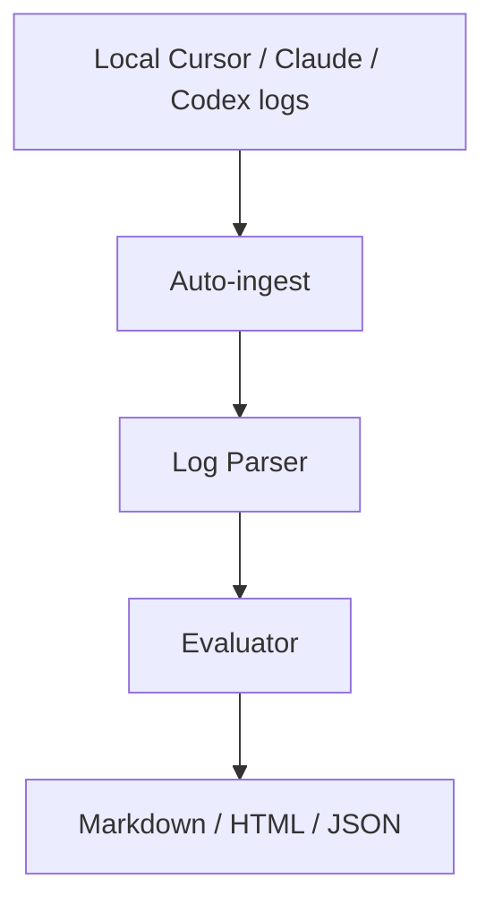

# AgentOps Lite

Local CLI for reviewing AI coding-agent runs. It reads Cursor / Claude Code / Codex logs, scores the workflow, and writes Markdown, HTML, and JSON reports. Nothing leaves your machine unless you opt into the optional LLM reviewer.

## 30-second start

```bash
pip install "git+https://github.com/tangyf07/AgentOps-Lite.git"
agentops-lite
```

That installs the `agentops-lite` command, looks for local agent logs in common Windows / macOS / Linux paths, and writes `outputs/latest_report.html`.

From a clone:

```bash
pip install -e .
agentops-lite sample
```

Open `outputs/sample_report.html`. No task YAML is required for auto-ingest.

## What it does

- Auto-ingests Cursor Agent JSONL, Claude Code `~/.claude/projects` JSONL, and Codex `~/.codex/sessions` rollouts
- Parses planning, file reads/writes, commands, errors, retries, tests, and final summaries
- Scores completion, code quality, reliability, and cost efficiency
- Writes local Markdown / HTML / JSON
- Compares multiple runs
- Optional OpenAI-compatible reviewer only if `OPENAI_API_KEY` is set



## Commands

```bash
agentops-lite
agentops-lite ingest --list
agentops-lite ingest --source cursor --out outputs/cursor_report
agentops-lite sample
agentops-lite analyze --agent Codex --model gpt-5-codex --task examples/tasks/bugfix_login.yaml --log examples/logs/codex_bugfix_login.txt --diff examples/diffs/codex_bugfix_login.diff --out outputs/codex_bugfix_report
agentops-lite compare outputs/*.json --out outputs/comparison.html
```

`analyze` still accepts YAML. If you omit `--task` / `--log`, it falls back to auto-ingest.

## Where it looks

| Source | Typical paths |
| --- | --- |
| Cursor | `~/.cursor/projects/*/agent-transcripts/**/*.jsonl` (Windows: `%USERPROFILE%\.cursor\...`) |
| Claude Code | `~/.claude/projects/*/*.jsonl`, plus `CLAUDE_CONFIG_DIR` |
| Codex | `~/.codex/sessions/YYYY/MM/DD/rollout-*.jsonl`, plus `CODEX_HOME` |

Pass extra files with `agentops-lite ingest --dir PATH`.

## Formats that are documented, not silently skipped

- Cursor IDE chat protobuf in `state.vscdb` / `store.db`: found, reported as unsupported. Agent JSONL is parsed.
- OpenCode SQLite (`~/.local/share/opencode/opencode.db`): not parsed.
- Codex `encrypted_content` reasoning blobs: skipped with a parse note.
- Copilot CLI session-state and Hermes `state.db`: not parsed.

Unknown JSON objects keep a note with their keys instead of disappearing.

## Sample report

A realistic, secret-free sample is checked in at [`examples/reports/sample_report.md`](examples/reports/sample_report.md).

## Task YAML (optional)

```yaml
task_name: Fix login validation bug
task_type: bug_fix
task_description: |
  The login form accepts empty passwords in some cases.
```

## Development

```bash
pip install -e ".[dev]"
pytest
agentops-lite sample
```

Fully local. The optional reviewer is skipped unless `OPENAI_API_KEY` is set.
