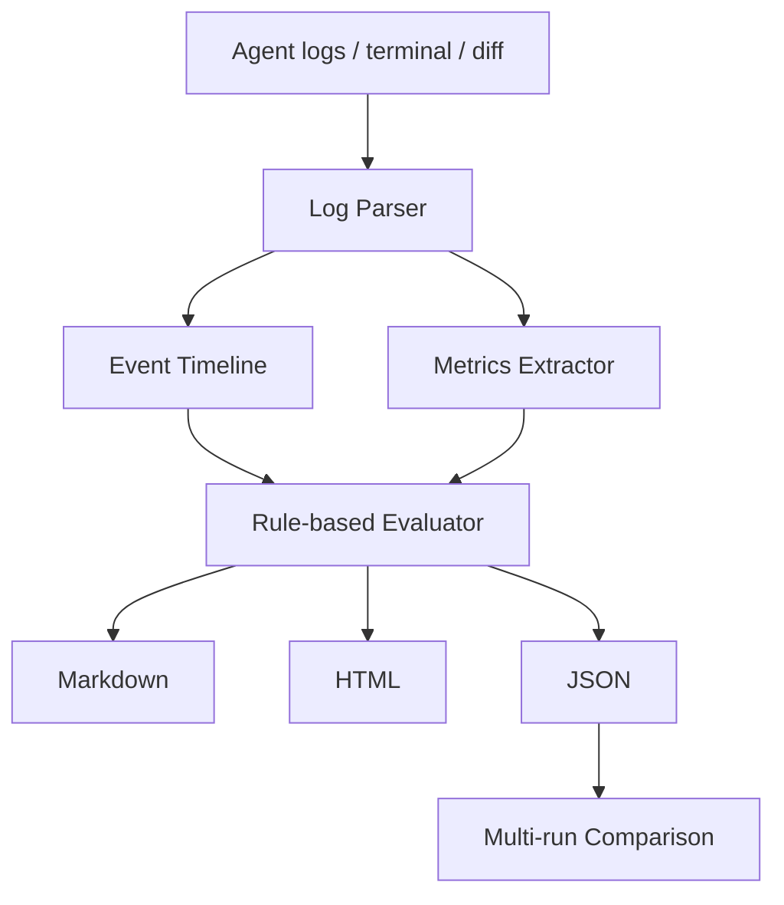

# AgentOps Lite

面向 AI Builder 的轻量级本地 CLI：把 Codex、Claude Code、Cursor、OpenCode 打散在任务描述、运行日志、终端输出和代码 Diff 里的执行记录，解析成事件时间线，打分，并生成 Markdown / HTML / JSON 报告。

Agent 做完活之后，证据通常散落在对话、终端、补丁和测试输出里，很难复盘失败或对比模型。AgentOps Lite 把这些痕迹收成一份可检查的本地报告。全程本地运行，可选接入 OpenAI 兼容接口做二次评审。

## 能做什么

- 导入任务 YAML、Agent 日志和代码 Diff
- 识别计划、文件读写、命令、错误、重试、测试、人工介入、最终总结等事件
- 按完成度、代码质量、可靠性、成本效率打分
- 生成本地 Markdown / HTML / JSON 报告
- 把多次运行对比成一张 HTML 表
- 设置 `OPENAI_API_KEY` 后可选用 OpenAI 兼容评审器



## 安装

```bash
git clone https://github.com/tangyf07/AgentOps-Lite.git
cd AgentOps-Lite
pip install -r requirements.txt
```

依赖：`pydantic` `jinja2` `rich` `pyyaml` `pytest`（见 `requirements.txt`）。

## 快速开始

```bash
python main.py sample
```

会生成：

- `outputs/sample_report.md`
- `outputs/sample_report.html`
- `outputs/sample_report.json`

用浏览器打开 HTML 即可看评分卡、指标表和时间线。

## 分析一次运行

```bash
python main.py analyze \
  --agent Codex \
  --model gpt-5-codex \
  --task examples/tasks/bugfix_login.yaml \
  --log examples/logs/codex_bugfix_login.txt \
  --diff examples/diffs/codex_bugfix_login.diff \
  --out outputs/codex_bugfix_report
```

开启可选评审器：

```bash
OPENAI_API_KEY=your_key python main.py analyze \
  --agent Codex \
  --model gpt-5-codex \
  --task examples/tasks/bugfix_login.yaml \
  --log examples/logs/codex_bugfix_login.txt \
  --diff examples/diffs/codex_bugfix_login.diff \
  --out outputs/codex_bugfix_report \
  --use-llm-reviewer
```

## 对比多次运行

```bash
python main.py compare outputs/*.json --out outputs/comparison.html
```

## 任务 YAML 示例

```yaml
task_name: Fix login validation bug
task_type: bug_fix
task_description: |
  The login form accepts empty passwords in some cases. The agent should locate the validation logic,
  fix the bug, and add or run tests.
expected_behavior:
  - Empty password should be rejected
  - Existing login behavior should not break
  - Tests should pass
success_criteria:
  - Validation logic is updated
  - A test command is run
  - No obvious regression is introduced
```

## 测试

```bash
pytest
```

建议同时跑一遍 sample，确认报告能生成：

```bash
python main.py sample
```

## 目录

```
agentops_lite/   解析、评测、报告
examples/        示例任务、日志、Diff
prompts/         可选评审器提示
templates/       报告模板
tests/           pytest
outputs/         生成结果（可忽略）
```

请不要把 `__pycache__/` 提交进仓库。
