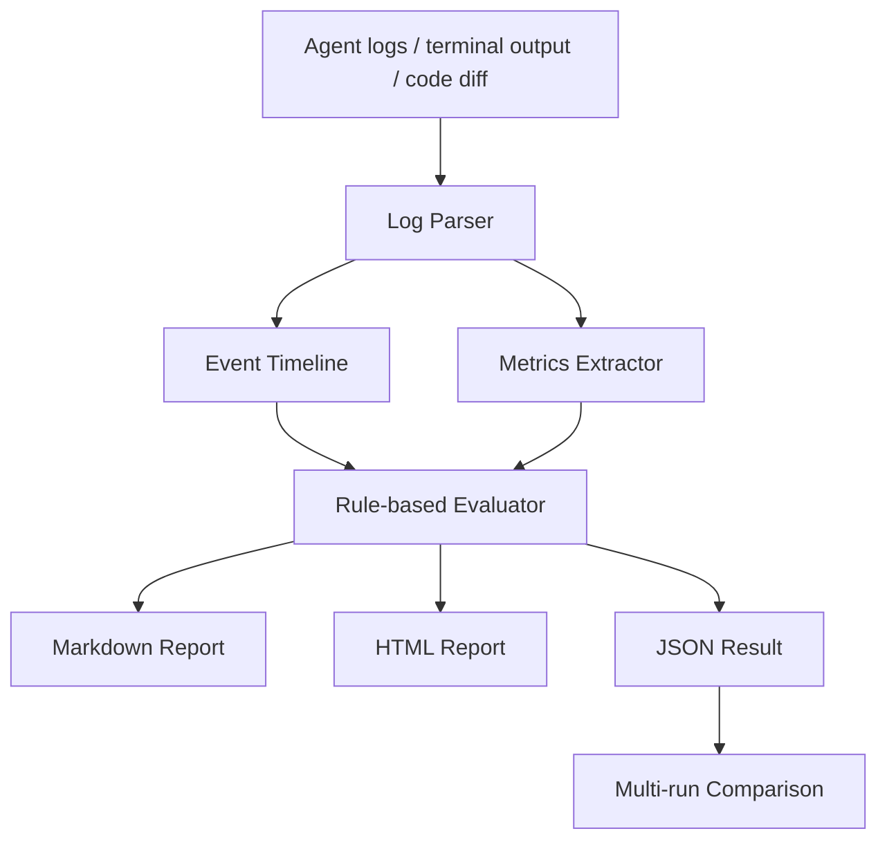

# AgentOps Lite

AgentOps Lite is a lightweight local CLI for evaluating AI coding agent workflows. It parses logs, terminal output, task descriptions, and code diffs from tools like Codex, Claude Code, Cursor, and OpenCode, then turns scattered execution traces into readable Markdown, HTML, and JSON reports.

## Why This Exists

AI Builders often finish a coding session with useful but fragmented evidence: chat history, terminal output, patches, failed tests, retries, and a final answer. AgentOps Lite makes that workflow inspectable. It helps compare agents and models across bug fixes, refactors, test generation, and other real development tasks.

## Core Features

- Import task YAML, agent logs, and code diffs.
- Detect planning, file reads, file writes, commands, errors, retries, tests, human intervention, and final summaries.
- Calculate completion, code quality, reliability, cost efficiency, and overall scores.
- Generate Markdown, HTML, and JSON reports locally.
- Compare multiple agent runs in a single HTML table.
- Optionally call an OpenAI-compatible reviewer when `OPENAI_API_KEY` is available.

## Workflow



## Installation

```bash
pip install -r requirements.txt
```

AgentOps Lite is designed to run locally. The optional LLM reviewer is skipped unless you set `OPENAI_API_KEY`.

## Quick Start

```bash
python main.py sample
```

This generates:

- `outputs/sample_report.md`
- `outputs/sample_report.html`
- `outputs/sample_report.json`

Open `outputs/sample_report.html` in a browser to view the visual report.

## Analyze A Run

```bash
python main.py analyze \
  --agent Codex \
  --model gpt-5-codex \
  --task examples/tasks/bugfix_login.yaml \
  --log examples/logs/codex_bugfix_login.txt \
  --diff examples/diffs/codex_bugfix_login.diff \
  --out outputs/codex_bugfix_report
```

To enable the optional reviewer:

```bash
OPENAI_API_KEY=your_key python main.py analyze \
  --agent Codex \
  --model gpt-5-codex \
  --task examples/tasks/bugfix_login.yaml \
  --log examples/logs/codex_bugfix_login.txt \
  --diff examples/diffs/codex_bugfix_login.diff \
  --out outputs/codex_bugfix_report \
  --use-llm-reviewer
```

## Compare Runs

```bash
python main.py compare outputs/*.json --out outputs/comparison.html
```

The comparison report highlights the run with the highest overall score.

## Task YAML Format

```yaml
task_name: Fix login validation bug
task_type: bug_fix
task_description: |
  The login form accepts empty passwords in some cases. The agent should locate the validation logic,
  fix the bug, and add or run tests.
expected_behavior:
  - Empty password should be rejected
  - Existing login behavior should not break
  - Tests should pass
success_criteria:
  - Validation logic is updated
  - A test command is run
  - No obvious regression is introduced
```

## Output Report Screenshot Placeholder

After running `python main.py sample`, open `outputs/sample_report.html` and capture:

- the top score card section,
- the metrics table,
- the agent timeline,
- the strengths and improvement suggestions section.

These sections are best for GitHub README screenshots, demo videos, and application proof.

## Good Use Cases

- Reviewing why an agent failed a bug fix.
- Comparing Codex, Claude Code, Cursor, and OpenCode on the same task.
- Tracking retry count, error count, test coverage signals, and command volume.
- Building a lightweight evidence trail for AI Builder applications.
- Creating local reports for screenshots, screen recordings, and GitHub demos.

## Roadmap

- Richer token and cost estimation.
- Native importers for common coding agent transcript formats.
- Timeline grouping by phase.
- More detailed diff risk analysis.
- Optional local model reviewer.
- Browser-based dashboard for multiple runs.

## Application-Ready Project Description

I built AgentOps Lite, a lightweight workflow evaluation tool for AI Builders. It analyzes execution records from AI coding agents such as Codex, Claude Code, Cursor, and OpenCode. The project solves a real pain point: agent work is scattered across conversations, terminal logs, code diffs, and test output, making it hard to review failures or compare model performance.

The workflow is: import agent logs, task descriptions, and code diffs; parse planning, file reads, code edits, command execution, errors, retries, tests, and final summaries; extract metrics such as touched files, command count, error count, retry count, test count, diff lines, complexity, and cost level; score the run across completion, code quality, reliability, and cost efficiency; generate Markdown, HTML, and JSON reports; and compare multiple runs.

AgentOps Lite demonstrates multi-stage agent workflow thinking: task trace reconstruction, metric extraction, rule-based evaluation, cost analysis, and improvement advice generation. It runs locally, includes realistic sample logs and diffs, and can be used to review AI agent development tasks, compare model behavior, and improve future AI coding workflows.

## Development

Run tests:

```bash
pytest
```

Smoke checks:

```bash
pip install -r requirements.txt
python main.py sample
python main.py analyze --agent Codex --model gpt-5-codex --task examples/tasks/bugfix_login.yaml --log examples/logs/codex_bugfix_login.txt --diff examples/diffs/codex_bugfix_login.diff --out outputs/codex_bugfix_report
pytest
```
